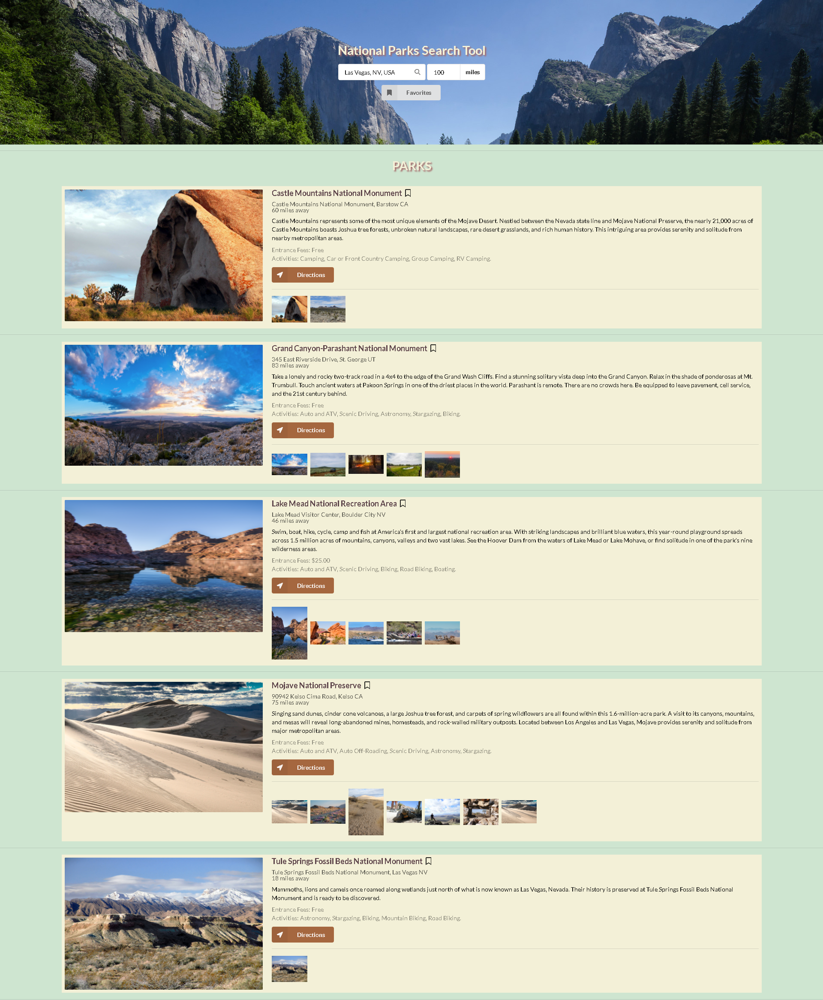

# Endless Trails
National Park Search Tool

## Elevator Pitch
* Who Are We?
  * We are a diverse group of programmers who really enjoy traveling, seeing sights, and spending time in the beautiful outdoors.
* What Did We Do?
  * Our goal was to make a resource that fellow travelers can use to look for national parks near their home city or a city they will be visiting soon.
* How Did We Do It and What Is New?
  * Using the National Parks Service and Google Predictions APIs, a drop-down list of potential city choices will appear as the user types the first few letters of a city name.  When they choose a city and a distance, all national parks near that city will be listed, along with a picture, some information about the park, and a few thumbnails of images related to that park.

## Concept
* Description
  * Shows national parks on search, by city and distance, with one click
* Motivation
  * Our love for travel and outdoors, the need for a tool to find the next outdoor adventure to visit our gorgeous national parks
* User Story
  * AS A lover of travel
  * WE WANT a tool to let anyone search for national parks
  * SO THAT anyone can find their way to adventure near the next travel destination

## Website
* https://gkowligi1392.github.io/NationalParkSearch/

## Screenshot

## Technologies Used
* HTML
* CSS
* JavaScript
* Local-Storage Api
* Color Hunt (for color palette)
* Font Awesome (for icons)
* Web APIs
  * jQuery (required for Semantic UI) 
  * Lightbox API (to increase size of images)
* Server-Side APIs
  * National Parks Api
  * Google Prediction Api
* Framework
  * Semantic UI

## Directions for Future Development
* Enhancements to Existing UI
* Extend to Regional/State Parks
* Search for Specific Amenities (i.e. Restroooms, Pet Friendly, etc.)
* Check-In/Sticker Badge Collection
* Mobile App

Created by Sivan, Jose, Jason, Gokul, And Antonio
